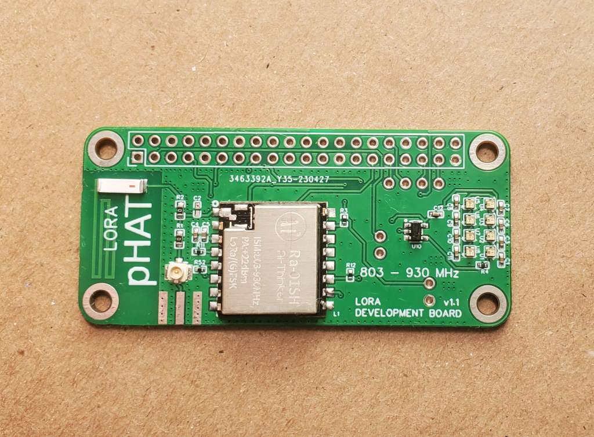
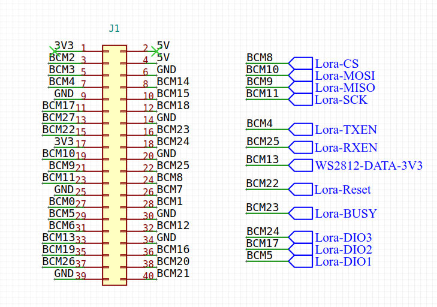

# lora-pHAT

Plug-n-play lora board for the raspberry pi platform.

# header pinout

# lora module communication
The lora module is available via the SPI(0) bus on the raspberry pi.

See the send and receive examples that demonstrate basic communication.

The lora example code uses the LoRaRF python library.
https://github.com/chandrawi/LoRaRF-Python

Install the LoRaRF library using pip command on the raspberry pi.

> pip3 install LoRaRF

# ws2812b (aka neopixel) lights
Data channel is GPIO 13

There are 8 ws2812b lights on the lora-pHAT board available for user programming.

See included code examples for light demo.

The example uses the rpi_ws281x python library for raspberry pi.
https://github.com/jgarff/rpi_ws281x

Install the rpi_ws281x library using pip command on the raspberry pi.
> sudo pip3 install rpi-ws281x

run the app example:
> sudo python3 lights.py
* note: sudo is required because lights use DMA and need access to /dev/mem

# using with the Raspberry Pi
See the python example code.

General instructions;

- Plug in the lora-pHAT

- install python example (either send or receive)

- run the python example
> python3 send.py

OR
> python3 receive.py

# troubleshooting

## Lights not working?

If you are running the Full (desktop) version of raspbian, you will need to disable onboard audio support to allow the lights to use PWM channel + DMA.
* see the rpi_ws281x repo for more information

You will know this is an issue, because only the first LED will blink green when you run the test script.

Lights Fix:
- Disable audio using the following command;
> sudo echo "blacklist snd_bcm2835" >  /etc/modprobe.d/snd-blacklist.conf

- reboot the raspberry pi
> sudo reboot
